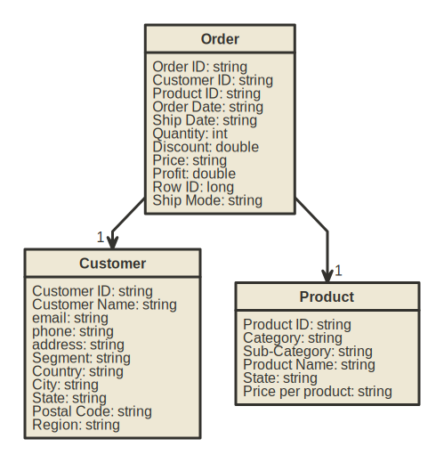

# E-commerce Data Processing System

This repository contains a set of Databricks notebooks designed to process and analyze sales data for an e-commerce platform. The system is built to handle large volumes of data, providing valuable insights through data aggregation and analysis.

## Notebooks Description

- **DataInsightAggregator**: Contains various functions for aggregating sales data, transforming raw data into structured formats suitable for analysis. This notebook serves as the core of the data processing system, implementing the logic for data enrichment and aggregation.

- **Test_DataInsightAggregator**: Includes sample test cases to ensure the correctness of the data aggregations performed by the `DataInsightAggregator`. This notebook follows a test-driven development (TDD) approach, validating the functionality and reliability of the system.By incorporating the %run ./DataInsightAggregator command, we seamlessly link our testing framework with the core application functionality. . Each change to the application is validated against these tests, guaranteeing that our application
- **InitiateDataPipeline**: Features the main method for running the entire data processing workflow. It orchestrates the execution of data processing tasks, from reading source datasets to outputting aggregated insights.

## Use Case

### Scenario

The project aims to design and implement a scalable, efficient, and reliable data engineering solution for processing e-commerce sales data using Databricks and PySpark. The platform generates detailed data on orders, products, customers, and transactions, requiring a sophisticated system to process and analyze this information.

### Source Datasets

- Orders: Order.json
- Customers: Customer.xlsx
- Products: Product.csv

### Data Transformation and Processing Tasks

1. **Create Raw Tables**: Initial tables are created for each source dataset, serving as the foundation for further processing.

2. **Data Enrichment**: 
   - Enrich customer and product information to create comprehensive profiles.
   - Enrich order information with details such as profit (rounded to 2 decimal places), customer name and country, and product category and sub-category.

3. **Aggregate Table**: An aggregated table is created to showcase profit by various dimensions such as year, product category, sub-category, and customer.

4. **SQL Aggregates**: The system outputs several key aggregations, including profit by year, profit by year plus product category, profit by customer, and profit by customer plus year.

## Entity Relationship Diagram

